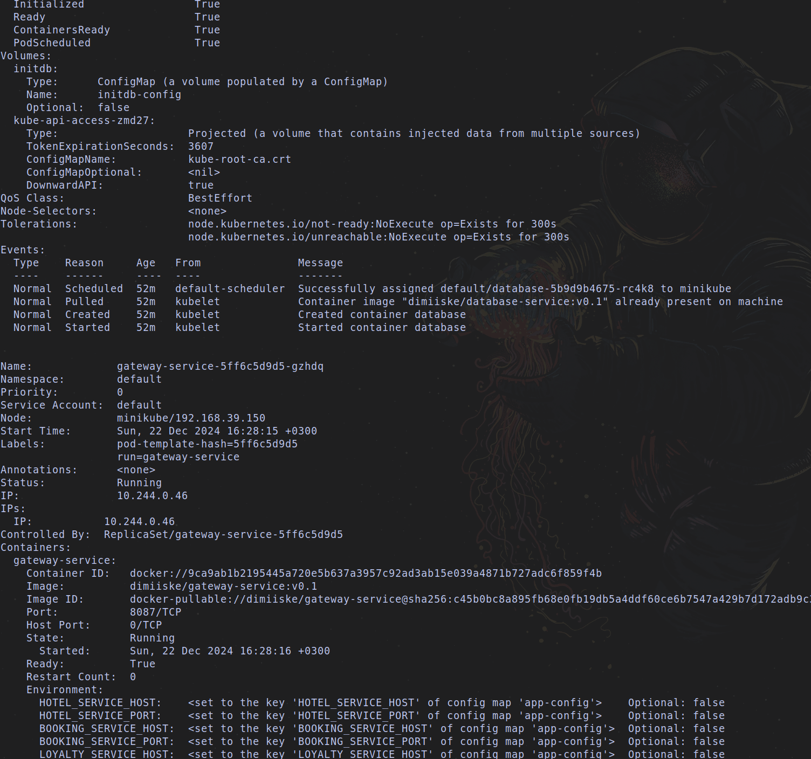
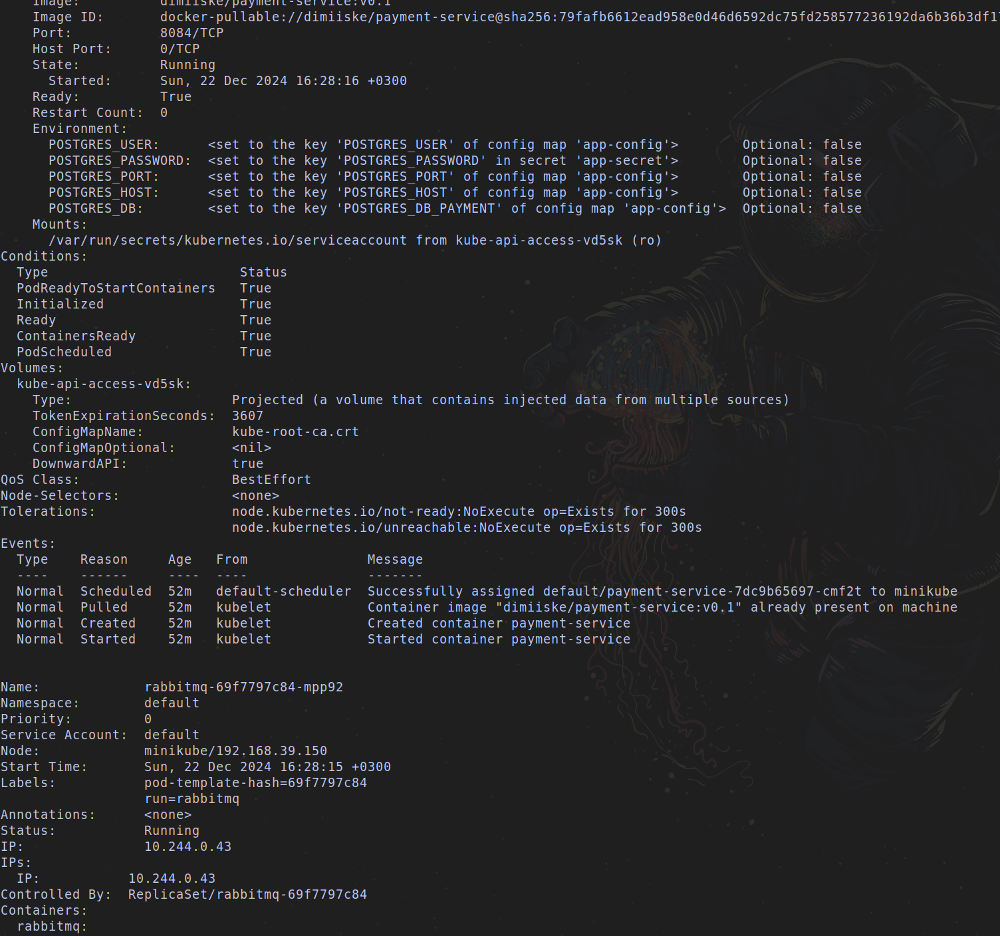
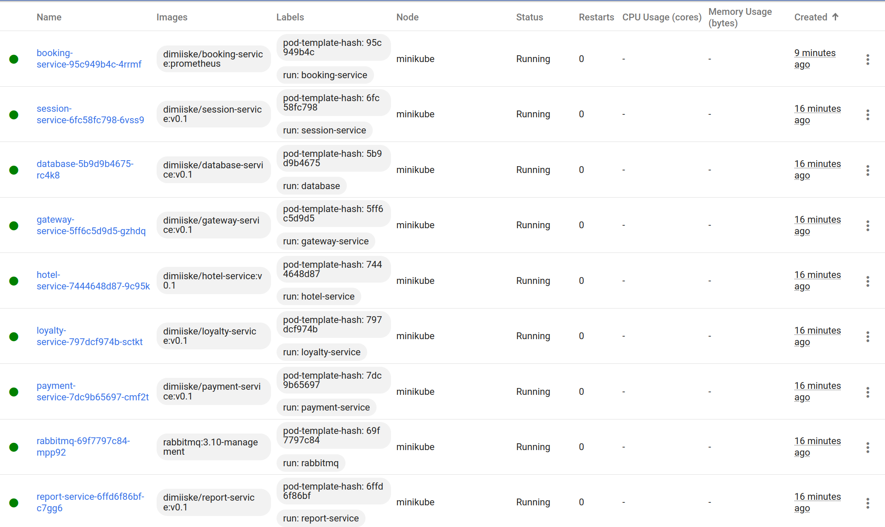
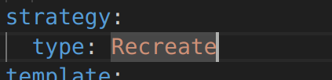

# Basic Kubernetes

The result of the work must be a report with detailed descriptions of the implementation of each of the points with screenshots. The report is prepared as a markdown file in the `src` directory named `REPORT.MD`.

## Part 1. Ready-made manifest

1) Run a Kubernetes environment with 4GB memory

2) Apply the manifest from the `/src/example` directory to the created Kubernetes environment

3) Run the standard Kubernetes control panel with the `minikube dashboard`

4) Create tunnels to access the deployed services with the command `minikube services`

All services:

Only apache:

5) Check if the deployed application works by opening the application page in the browser (apache service)

## Part 2. Your own manifest

1) Write your own yml-files of manifests for the application from the first project (`/src/services`) implementing the following:
   - Configuration map with the values of database hosts and services
   - Secrets with the password and login to the database and cross-service authorization keys (they can be found in the `application.properties` files)
   - Pods and services for all application modules: postgres, rabbitmq and 7 application services. Use a single replica for all services.

2) Run the application by sequentially applying manifests with the command `kubectl apply -f <manifest>.yaml`.

3) Check the status of created objects (secrets, configuration map, pods and services) in the cluster using `kubectl get <object_type> <object_name>` and `kubectl describe <object_type> <object_name>`. Add the result to the report.

4) Check for correct secret values by applying, for example, the command: `kubectl get secret my-secret -o jsonpath='{.data.password}' | base64 --decode` to decode the secret.

5) Check the logs of the application running in the cluster with the command `kubectl logs <container_name>`. Add a screenshot to the report.

6) Create tunnels to access the gateway service and session service.

7) Run postman functional tests and make sure that the application works.

8) Run the standard Kubernetes control panel with the command `minikube dashboard`. Include the following information in the report as screenshots from the dashboard: the current state of the cluster nodes, a list of running Pods, and other metrics such as CPU and memory utilization, Pod logs, configurations on the Pod and secrets.

9) Update the application (by adding a new dependency to the pom file), and rebuild the application with the following deployment strategies (measure the application re-deployment time for each case and note the results in the report):
   - recreate

   - rolling

